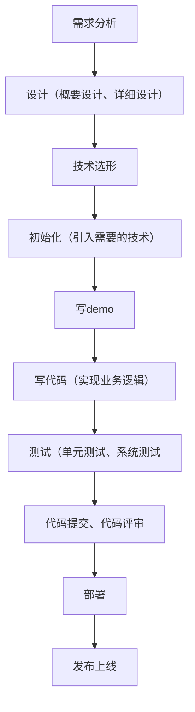

# 企业做项目流程




# 初始化项目

## 瘦身

> 删除文件时要保证没有被其他地方引用
> 删掉文件后，也要删掉对应的路由。不然路由找不到会报错
> 路由在config下的routes.js中

1. locales(国际化)

   用脚本删除 - i18n-remove

2. e2e(自动化测试)

3. src-services-swagger(接口文档工具)

4. config-oneapi.json(接口) 

   config.ts-openAPI中使用到了，要删除掉

5. test(测试)

6. jest.config.js(测试工具)

7. playwright.config.ts(针对不同浏览器，不用打开就可以进行测试的工具)

# 数据库设计

## 创建表

利用IDEA的database面板 -> 右键 -> new table -> Table：user；Comment：用户

id/bigint -> [✓] Auto inc（自增）；[✓] Primary key（主键）；Comment：id

username/varchar(256) -> Comment：用户昵称

userAccount/varchar(256) -> Comment：账号

avatarUrl/varchar(1024) -> Comment：用户头像

gender/tinyint -> Comment：性别

userPassword/varchar(512) -> [✓] not null；Comment：密码

phone/varchar(128) -> Comment：电话

email/varchar(512) -> Comment：邮箱

userStatus/int -> default：0；[✓] not null；Comment：用户状态

createTime/datetime -> default：CURRENT_TIMESTAMP；Comment：创建时间

updateTime/datetime -> default：CURRENT_TIMESTAMP；Comment：更新时间

isDelete/tinyint -> default：0；[✓] not null；Comment：是否删除

userRole/int -> default：0；[✓] not null；Comment：0 - 普通用户，1 - 管理员


# 登录/注册

## 后端

### 规整项目目录

1. 删除一些东西
2. 创建controller、service和utils文件夹

### 实现基本数据库操作（操作user表）

1. user对象和数据库表关联（利用MybatisX插件快速生成）

2. user表右击 -> MG 

3. Generate Options

   1. base package(genetator)
   2. encoding(UTF-8)
   3. base  path(src/main/java)
   4. relative package(domain)
   5. camel

4. next

   1. Mybatis-Plus 3
   2. Comment
   3. toString/hashCode/equals
   4. Lombok
   5. Actual Column
   6. Model
   7. mybatis-plus3

5. 测试

   1. UserService -> 鼠标 -> Alt  + Enter -> 生成测试类

   2. ```java
      @Resource
      private UserService userService;
      
      @Test
      void testAddUser() {
          User user = new User();
          //利用GenerateAllSetter插件快速生成set方法：在user对象上按Alt+Enter
          //删除带有默认值的set方法
          boolean result = userService.save(user);
          System.out.println(user.getId());
          Assertions.assertTrue(result);
      }
      ```

   3. mybatis-plus 开启了自动驼峰命名规则映射，需要手动关闭，不然会报错

      ```yaml
      mybatis-plus:
        configuration:
          map-underscore-to-camel-case: false
      ```


### 注册功能

在service层实现业务逻辑

#### 详细设计

见[用户中心直播笔记](file:///D:/\Documents\notebook\计算机\星球项目\用户中心管理\用户中心直播笔记.md)


#### 接口逻辑

1. UserService

   ```java
   public interface UserService extends IService<User> {
       //在方法上加注释
       //选中userRegister后按Alt+Enter快速实现方法
       long userRegister(String userAccount, String userPassword, String checkPassword);
       
   }
   ```

   

#### 实现逻辑

1. UserServiceImpl

   ```java
   @Service
   public class UserServiceImpl extends ServiceImpl<UserMapper, User>
           implements UserService {
       @Resource
       private UserMapper userMapper;
   
       /**
        * 盐值、混淆密码
        */
       private static final String SALT = "yupi";
   
       @override
       public long userRegister(String userAccount, String userPassword, String checkPassword){
           //1.校验
           StringUtils.isAnyBlank();
           //账户不能包含特殊字符
           String validPattern = "";
           Pattern matcher = Pattern.compile(validPattern).matcher(userAccount);
           //密码和校验密码相同
   
           //账户不能重复
           long count = userMapper.selectCount(new QueryWrapper<User>().eq("userAccount", userAccount));
   
           //2.加密
           String encryptPassword = DigestUtils.md5DigestAsHes((SALT+userPassword).getBytes());
           //3.插入数据
           Boolean saveResult = this.save(user);
   
           return user.getId();
       }
       
   }
   ```

   


#### 持续优化


#### 单元测试

1. UserServiceTest

   ```java
   @SpringBootTest
   class UserServiceTest {
       @Resource
       private UserService userService;
   
       @Test
       void userRegister(){
           userAccount, userPassword, checkPassword
           userService.userRegister(userAccount, userPassword, checkPassword)
           //1.校验
           String userAccount = "yupi";
           String userPassword = "";
           String checkPassword = "123456";
           long result = userService.userRegister(userAccount, userPassword, checkPassword);
           Assertions.assertEquals(-1, result);
           //2.加密
   
           //3.插入数据
       }
       
   }
   ```

   


### 登录功能

#### 详细设计

见[用户中心直播笔记](D:\Documents\notebook\计算机\星球项目\用户中心管理\用户中心直播笔记.md)


#### 接口逻辑

1. UserService

   ```java
   public interface UserService extends IService<User> {
       //在方法上加注释
       User userLogin(String userAccount, String userPassword, HttpServletRequest request);
       
   }
   ```

   

#### 实现逻辑

1. UserServiceImpl

   ```java
   @Service
   public class UserServiceImpl extends ServiceImpl<UserMapper, User>
           implements UserService {
       
       @Resource
       private UserMappaer userMapper;
   
       /**
        * 盐值、混淆密码
        */
       private static final String SALT = "yupi";
       
       private static final String USER_LOGIN_STATE = 	"userLoginState";
   
       @Override
       public User userLogin(String userAccount, String userPassword, HttpServletRequest request){
           //1.校验
           //非空
           StringUtils.isAnyBlank();
           //账户长度 不小于 4 位
   		//密码就 不小于 8 位吧
           //账户不能包含特殊字符
           String validPattern = "";
           Pattern matcher = Pattern.compile(validPattern).matcher(userAccount);
   
           //2.加密
           String encryptPassword = DigestUtils.md5DigestAsHex((SALT+userPassword).getBytes());
           //查询用户是否存在
           //账户和密码作为查询条件
           User user = userMapper.selectOne(queryWrapper);
           //用户不存在时打印日志信息
           log.info("");
           
           //3.用户脱敏
           User safetyUser = new User();
           safetyUser.setId(user.getId());
           //...
   
           //4.记录用户的登录态（cookie 和 session）
    		request.getSession().setAttribute(USER_LOGIN_STATE, safetyUser);
           
           return safetyUser;
       }
       
   }
   ```

   

2. 配置逻辑删除

   1. 在 `application.yml` 中配置 MyBatis-Plus 的全局逻辑删除属性。

      ```yaml
      mybatis-plus:
        global-config:
          db-config:
            logic-delete-field: isDelete # 全局逻辑删除字段名
            logic-delete-value: 1 # 逻辑已删除值
            logic-not-delete-value: 0 # 逻辑未删除值
      ```


   2. 在实体类中，对应数据库表的逻辑删除字段上添加 `@TableLogic` 注解。

      ```java
      import com.baomidou.mybatisplus.annotation.TableLogic;
      
      @TableName(value ="user")
      @Data
      public class User implements Serializable {
          // 其他字段...
      
          /**
           * 是否删除
           */
          @TableLogic
          private Integer isDelete;
      }
      ```

      

#### 持续优化


#### 单元测试


### 控制层

#### 详细设计

见[用户中心直播笔记](D:\Documents\notebook\计算机\星球项目\用户中心管理\用户中心直播笔记.md)


#### 实现逻辑

1. UserController

   ```java
   @RestController
   @RequestMapping("/user")
   public class UserController {
       
       @Resource
       private UserService userService;
       
       @PostMapping("/register")
       public Long userRegister(@RequestBody UserRegisterRequest userRegisterRequest) {
    		//判断是否为空
           //请求参数校验
           //调用方法
       }
       
       @PostMapping("/login")
       public Long userLogin(@RequestBody UserLoginRequest userLoginRequest) {
    		//判断是否为空
           //请求参数校验
           //调用方法
       }
   }
   ```

   

2. 请求参数封装为对象

   1. UserRegisterRequest

      ```java
      @Data
      public class UserRegisterRequest implements Serializable {
       	//UID
          //属性（请求参数）
      }
      ```


   2. UserLoginRequest

      ```java
      @Data
      public class UserLoginRequest implements Serializable {
       	//UID
          //属性（请求参数）
      }
      ```

      

3. 获取当前登录用户信息的接口。

   ```java
   @RestController
   @RequestMapping("/user")
   public class UserController {
       //...
       
       @GetMapping("/current")
       public User getCurrentUser(HttpServletRequest request){
           //1.查询登录态
           
           //2.得到用户id
           user.getId();
    
           // todo 校验用户是否合法
           //3.根据id去查询数据库
           
           //4.返回脱敏后的用户信息
       }
       
   }
   ```

   

#### 持续优化

1. 在getSafetyUser()方法中对用user是否为空增加判断

#### 单元测试

1. 点击UserController方法旁边的小图标可以进行http测试。

   ```http
   POST http://localhost:8080/user/login
   Current-Type: application/json
   
   {
     "userAccount": "yupi",
     "userPassword": 12345678
   }
   ```

   


## 前端

### 登陆功能

1. **注意：**项目路径更改后，记得删除../node_modules/.cache 文件夹，不然项目运行时会报错。


2. 路径：src/app.tsx；前端入口介绍

   ```tsx
   /**
    * 这个页面是程序启动入口，每次刷新页面都会调用 getInitialState()方法，在这里获取登录态，并设置 initialState，
    * initialState 中存储的是全局数据，包括当前用户（currentUser）信息和其他信息，所有页面都可以使用
    *
    * @see  https://umijs.org/zh-CN/plugins/plugin-initial-state
    * */
   export async function getInitialState(): Promise<{
       //...
       
   ```

   

#### 修改页面

1. 路径：src/constants/index.ts；新建一个index.ts文件，提取常量。

   ```ts
   export const SYSTEM_LOGO = "data:image/png;base64,iVBORw0KGgoAAAANSUhEUgAAAXgAAAF4CAYAAABeneKmAAAACXBIWXMAABYlAAAWJQFJUiTwAAAAAXNSR0IArs4c6QAAAARnQU1BAACxjwv8YQUAABW4SURBVHgB7d1ByGVnfcfxZ9qCXbS6sRBQSzGLYqeL6KKtUgwFIxHspkoj2SUQtwnUXTHIuFWY7Iop2pWgYDYNJHTcRKi23ZiF1lVc1Liym2bnapp/3hwzJvNO7nvvuef8zv98PhBcOcPc997ve+45z/N/rt138/btAUA7vzMAaEngAZoSeICmBB6gKYEHaErgAZoSeICmBB6gKYEHaErgAZoSeICmBB6gKYEHaErgAZoSeICmBB6gKYEHaErgAZoSeICmBB6gKYEHaErgAZoSeICmBB6gKYEHaErgAZoSeICmBB6gKYEHaErgAZoSeICmBB6gKYEHaErgAZoSeICmBB6gKYEHaErgAZoSeICmBB6gKYEHaErgAZoSeICmBB6gKYEHaErgAZoSeICmBB6gKYEHaErgAZoSeICmBB6gKYEHaErgAZoSeICmBB6gKYEHaErgAZoSeICmBB6gKYEHaErgAZoSeICmBB6gKYEHaErgAZoSeICmBB6gKYEHaErgAZoSeICmBB6gKYEHaErgAZoSeICmBB6gKYEHaErgAZoSeICmBB6gKYEHaErgAZoSeICmBB6gKYEHaErgAZoSeICmBB6gKYEHaErgAZoSeICmBB6gKYEHaErgAZoSeICmBB6gKYEHaErgAZoSeICmBB6gKYEHaErgAZoSeICmfm8Q70PvHePvPzLGw/eP8ed/NM7mJ78a49kfj/Hdn41Ne+KBMR75szGun/m1+tEvL16vX7w2INK1+27evj2IVbH60l+N8d73jMU8/dLr4Xp5bNI//OXF67Wkr/3HGF//zwFx3KIJdvOhMW48uGzcy9K/UOZS33SWjnupv/PGJwfEEfhQFfe6zbCGivsnPjA25/r7x2qe+OjFzwySCHyYiuv3Prde3Lfsfb8/VlU/s1uPbvPbDz0JfJAp7p/44FjdT/93bM4Lr4zx2q/HquoheP0MRZ4EAh+i7h9XGM65SuZQ9cBwiytDKu5fC3jYWT/D7z968TOFNQl8gLS416qQrapliwkrWqafqcizJoFfWVIIth73ScqyRZFnbQK/InE/H5EHgV/N9DBO3M8nLfLXA27BsS8CvwJxX05S5J8TeRYm8AurmTIpy+i6x32SEvn6mVfka6YQLEHgF1Rxf+bT4r6GpMh/67MX7wU4N4FfSA0Nq7gn2FvcJ0lDweq9UO8JOKff/YOHv/KVwVnVhMN//OsRYa9xn/zw1TGuXcvYLfw3f3LxvzV2GM7BFfyZrTG+9jJ7j/sk6Uq+3hv1HoFzEPgzEvdcIs8eONHpTGo+eI2QTSDudze9JglxnS4EHBzCnFzBn0HNBRf3bUi7kjdTnjkJ/IxqCdyaB3W8nbgfJiny9d6pZZTGDTMHgZ9J2kEd4n41SZGvjVBmyjMHgZ/BFPeEcb9F3I+TFPmkcRZsl8CfqD6AdbiDuPcg8nQi8CdIGwUr7vNIirxxw5xC4I8k7r2JPB0I/BHEfR9Enq0T+CtKO1BZ3M8rLfL13jNTnkMJ/BV8/ANZy9fEfRlJkZ9myos8hxD4A9X87uc+L+57lRb5upI3U553I/AHmA7qSCHu60iKfKn3pMhzLwL/LmoQlbgzSYy8SZRcRuDvIWncbxH3DGmRN26Yywj8JcSdexF5tkDg70LcOYTIk86BH2+TNO63iHu2pENDSkX+fe8Z4+kfDHAFfydx5xhpV/J12IyDQygCP/JmuRdx35a0yNd7+dajZsrv3e4DP8X9Ex8cMcR9m9IiP40bFvn92nXg02a5F3HftsTIJ81OYlm7DXzidD5x7yEt8iZR7tcuAy/unJvIk2B3gRd3liLyrG1XgU+8HynuvaVG3rjhfdhN4BNXFIj7PiRG3kz5fdhF4GukqrizprTITweHPHz/oLFr9928fXs0ljbLvYj7fiXOi3ny38b47s/G5tU3k9rF+/CHl70N+4vXxnj2x6//9/KI0zrwTzwwxo0HRxRxJzHyad8wrurGJy/ivpbXfj3Gn/7TiNN22FjaRMgi7pS0AWVl+qxsLfJ1q+mZh9a/1ZS6W7hl4MWddCJ/umnMSMJO9NTXrF3gxZ2tEPnjJa3pf+rWGN/57xGp1Sqaug8n7mxJ4r3v+gzVZymVuB+uzRV82iz3Iu4cIvFKvh5Y1i2QCliSpP0s6XEvm7+Crx+0uLN1iVfy9Zn61mdzHiDWg1Rxv5pNL5NMeshyJ3HP9vEPjPHc58fJfvjqGJ/73phV4hLKn/zq4t9ZSwHXkrKfpV6Dx56/+NlvwWav4Kf7cOLOVX3h+pjFOa7gEq/kp9sia93zrl94KXGvX3RbiXvZ5BV86lS8peJe31we+cjFLJH674/f+9bX1noT/s9rY7z6+n8vvDLGj355sdOOC/We+a/HxsnqNf2Lb42zSbySr39zBW7J91PKqrgp7vVtZks2F/g9x71uLdSb/arHC774eui/8eOL2O9dXQnW1/1TLbG9f++RT3m2ttW4l00Ffq9xr39vvdlPPTe2Qv/0D/Z7RT8d0XjqQ7p6/T717WXuSe8x8im7U0v9Gx9/fptxL5u5B7/2fcDLnDvuNU+nojTHoeD1gak/q/7MParXcI4VGHUPdqkHjon35M95oTUtnEiJ+1av3CebCPxe415XbjUsbc5lYfVn1Z+ZdlW4hLn+zUsHNzXydbEw50z56c9MWDixxvOGc4gPfN13TpvlXpaI+zkfLiV+9T+nupc7xwVCrZxZ40OfGPlppvwckU+6/dol7iU68PUwrNYr7y3udQtliZUD9Xfs5XbNVq/e75Qa+brqPuXBddJRmp3iXmIDn3hQR1nigeqSy8Lq7+p+CHN9C5zj31j33tf+4KfObT92dVLS7tRucS+Rga8f+h7jXmrI05Jv9mnUQ2df/NiYRZ3akyA58ldZDFC/EFJGIXSMe4kMfOIku6XWua+xeqA+lHOs0klUV+51hNup6oP/4s9HjNTIHxrspIu4rnEvcYGf62HYnJbaoTrXleYxuj5wnet2V+L4idR78o8ccKvmSyHvt2nOTte9IXGBn2OX4ZyWivtcV5rHmmuNeJJ6Ted4P9WHP/VQ6sTIH/It9HrAUsjucS9xgU8aHrbk4LCEWySPhP1yPdVcFwupcZ+kRT5tAODdJEzIXEJc4FOuIpeeCpmwcy/hqmpOc80x2cLc76TIp38T3EvcS6sj++ayxsjfD/3hWN0WrrwOtfWNTcdIffCaZJrhv4e4l3aHbp9qrXnuCQ+WO62H77Cx6RiJx/+lqFttNQV0T1zB32HNwzoSvtZ2echaD6vn+GVV0ze3+ADOlfw77THuReDf5CSmPurA6Dk8+/LYLJF/y17jXgR+ZMQ94Z5gh/uSdeU+x4qkunLf0tFsdyPy+4572X3gU67cE24FdFgP3Hlj0zH2HPn6d+857mXXgU+6LZNwqMDWA7+HjU3H2GPk3XK9sNvA14c46Q3w04DA1yHdW+bq/XL1b9rL0kBxf8tuA58Ws+8EXDFu+VDuWgFUw9pOVRHsejj5FjZsnSrtwm1tHrKGqLCs+VBvq0sCJ5+5f56lkS9s/HW4l//bwRX8Xr6lHGq3gU/ctbnmfdItLwkse93YdBVdR0LfqcZt7OHfeajdBr7eBAnzX+5UV/BrXMXX1fuWlwTucSzBVdVrtJfw1Uz67qeUHWrXt2ieeShvwNZTt5b9mll/19M/GJu2l6mRx6pvq4mH6JxLPY9JOQZwbbsO/HQqfNJv+zceEi14m6D+ri1ftdaD1TmuTNf69nRu9d7+ZsixeEuqf3ddye/d7h+yTr/tkyJfZ38ucS+4/o6Uc0aP9YXrYxYdV5jUezrtvb2k+sW/p28ud2MVzXjrg5B0lXPuzSkd1grb2HS5vcd9UnOJnnhg7JbAvyk18nV/fM578tM99w5rhW1surt6D3/Tg8bfuPHgflfWCPwdEh9G1S2UT317jBd/Pk5W95jrz9r6bZky1xm2dfU+x2ubpBYPdDq8ZQ43H9rnLzyBf5taTpYW+YrQY/96cRLNi0fswJ1Osel0wPBch4TXa9Npc0y9d9OW/yZI/Ia+BCc63UXdt6tdf2mbXqaVHtNI3Olgi/pveuNWrCriNbys5tvUCISOu/tsbHqnek3mmoXfUX1O6tvNY8+P3YgLfEUpYW36dH83MQAV8Fr1sYfZIndjY9M7VdzneiZxqoTBeZepbzf1Wu1lumbcLZqkIWD1gZlrEw3zcfX+22qVSErcy78fsJ9gzW+V9VrtZWVNXOBrJkrSLYVnPm22RZLa2DTH1Xvd6upw9V5XpLVKJMk/HzDX6BsrP+ivyKftYj+HuMBX3L8WdmVVO+L28GbYgi9+bMyiw0qiWilT95STfP3AndF1IbfmrZx6ZrWHmTWRq2jqw5e08WQvb4Z0lka+JXEEQUX70D0FdSFXDzvX/La+hzEOscsk6yzFpMjbGbg+G5suJL4X67P69EtX+r9cLP9deUVL90Fs0evgK/JJA6D2upY2gbEEFxJnJ9XejGMPt67P99rTTGtV1lwP7tPEb3Sq3/BJy65Efh1GAmfGvfZbPHlrnCThlmzXFXPxga97dH/3vazI722+doK6yprDlvcO1HsuaQRBxb12R89xH/3LL62/qumrD/ZbTLGJUQXTA5mkZW2JIw26srHp4r021y+5OdTr+PiMD0nrz5nrl8WxOi6m2MwsmnpDpc1SqW3hXe/dJdn7xqa0EQTn+izWn7f2/fhuK2s2NWwsMfJ1707kz2eat3OqehC4xav3pBEE5dyfwfqWtfYehU63YDc3TTI18kYanMdcV67PHrC7Mk29p/YU90ldxa+9eq7LyppNjgue3mhGGvQ2Tc08Vb1ftnbeao1kqPdUiuke+VIXVgnP3DpcuG12Hnxi5I00mNdeNzbVLYJ/+dsRY+m4T3/n48+v//ne+sqaTR/4MecyrTkYaTCfvW5sSnzIV5+xn6ywTLn+zrXnUm39M735E53qTbD2k/c7GWkwjz1evSe+d566tU7cJ/XAde2HrlteWdPiyL568v7Uibvp5mS362nqdat70Keqb3Y/+uXYhMRdqvWZStgYVlfxa290rNtmX9rgQ9c2Z7LWGzHxSl7kr+4z988Tuhc2tDQyLe61ZyBl12/C5MmyxX0vrQ7drq9ySZtZjDQ4zt42Nt18KGsEQb1uabe2EiZPlrp1uKVDzVsFvtQbM+mDbaTB1extLEH9MksaQZAY90nC5MlSh6xs5Rlbu8CXtMgbaXC4PU2NTNulmhz3ScLkycTnJZe5dt/N27dHU3XlnDTDI+0XD+sR9+NVYL//6PqBrW8UtYQ0Wcsr+El9nUu6kjPSgJI2gqA+I1taTpowebLULuv026+tA1/Sjv4z0mDf3jgoO2gEQX02jj2NaU0JkydL3SF44oERq33gSx0mkHRgiJEG+zQtnU3xxmlMG4z7JGHyZLnxYO5F2y4Cn3YqlJEG+5O2L2Ia87F1CZMnS+rneReBL1PkU5bOGWmwH2k/68RBfadImDxZv7gT78fvJvBljal499Lt9BjeKW1JXbe4l+lzveUD1c+l9TLJy6RdUdXX5Ye+PWjo1qM5u1QTD8uZW90Lr41j19+/7HOu+gw/HnZudNll4Eta5NMGpnG6GkGQskt1D3HnnXZ1i+ZOaW94Iw16SRpBIO77tdvAl3rDJ5waMzHSoIekXarTyUjivk+7DnxJOxWqwpC8cYJ7S4v7WqcxkWH3gS/1AUgYRTqpjRNGGmxP2giCJ2+J+94J/Jtqs0TSQ87azm6363akjSCo9/KLrwx2TuDvkLaS5bnPifwWpI0gqN2dKacxsS6Bf5v6YKSM9DXSIF/aCIJ67ybMZyGDwN9F0tx2Iw1ypf1stjTTnWUI/CXSIm+kQZa0EQTizt0I/D0kRb4e4tXtGjKIO1sg8O+iPjgpQ4xqzkZtf2dd9TNImS/z7MvizuUE/gBJp0LV9ne7XdeTNIKg3pNPvzTgUgJ/oIp8wsECpTbTiPzyknap1hr3LZ/GxDIE/gpqt2vKqVBGGiwrKe5vHLVn8igHEPgrSDv6z0iDZSSNIEibnUQ2gb+i+mAlHBE2+eqDdrueU9IIgrTpp+QT+CMkzdeu9djP2Qh1FkkjCMx05xgCf6S0yNvtOq+kEQTizrEE/gRJHzwjDeaT9FqKO6cQ+BMlnVJvpMHp6rX7ZsiAt+nADnHnWAI/g6TIG2lwmnrtEnapijtzEPiZJC1fM9LgOPWa1WuXwFF7zEHgZ1QfyDpsIYGRBleTNILgKUftMROBn1nSqVBGGhwmaZdqvXecxsRcBP4M6gOaciVvpMG91WuTEvca+yvuzEngz6SOTUuZJW+kwd3Va1KvTQIz3TkHgT+jpANDjDT4bbVS5qviTnMCf2YpkTfS4C1Ju1TFnXMS+AXUBzjhpHsjDcSdfRH4hdRD14RTofY80iDp317vBXHn3AR+QSlH/+1xpEHSCIJ6DziNiSUI/MK+/FLGgSF7G2nwTMhB2W+cxiTuLETgF5Z0KtReRhrc+OQYD98/VjeNs4ClCPwKpsgnDJLqPtKg/m1PfHSsLmkgHfsh8CtJmhbYdaRByggCcWctAr+ipMMcuo00SBlB4MAO1iTwK0sKQJeRBnW/PWEEgbizNoEPkBSCrY80qJUyzwQ8OBZ3Egh8iArB48+vf592yyMNUtb318+wfpbiztoEPkjKqVAVyC0un6x77mv/YpoenjuwgwQCH6bC8NjzY3UJm4Ku6uEPj9U96TQmggh8oB++mnMqFIern9mLrwyIIfCh1j7674UNhmrNK2dH7ZFI4INVMB5b4WFd/X0pB5VcRUV26ecX0z13cSfRtftu3r49iFYPDmtuTK1Rr3vj51olUrGqq+AK5VZXgNRrVQ9bz7mef3qd6nbMd35mhyq5BB6gKbdoAJoSeICmBB6gKYEHaErgAZoSeICmBB6gKYEHaErgAZoSeICmBB6gKYEHaErgAZoSeICmBB6gKYEHaErgAZoSeICmBB6gKYEHaErgAZoSeICmBB6gKYEHaErgAZoSeICmBB6gKYEHaErgAZoSeICmBB6gKYEHaErgAZoSeICmBB6gKYEHaErgAZoSeICmBB6gKYEHaErgAZoSeICmBB6gKYEHaErgAZoSeICmBB6gKYEHaErgAZoSeICmBB6gKYEHaErgAZoSeICmBB6gKYEHaErgAZoSeICmBB6gKYEHaErgAZoSeICmBB6gKYEHaErgAZoSeICmBB6gKYEHaErgAZoSeICmBB6gKYEHaErgAZoSeICmBB6gKYEHaErgAZoSeICmBB6gKYEHaErgAZoSeICmBB6gKYEHaErgAZoSeICmBB6gKYEHaErgAZoSeICmBB6gKYEHaErgAZoSeICmBB6gKYEHaErgAZoSeICmBB6gKYEHaErgAZoSeICmBB6gKYEHaErgAZr6fw0h5oIZzj7WAAAAAElFTkSuQmCC";
   
   /**
    * 知识星球地址
    */
   export const PLANET_LINK = "https://zsxq.com";
   
   ```

   

2. 路径：src/components/Footer/index.tsx；修改Footer。

   ```ts
   import { GithubOutlined } from '@ant-design/icons';
   import { DefaultFooter } from '@ant-design/pro-components';
   import React from 'react';
   import {PLANET_LINK} from "@/constants";
   
   const Footer: React.FC = () => {
     const defaultMessage = '鱼皮出品';
     const currentYear = new Date().getFullYear();
     return (
       <DefaultFooter
         //修改版权信息
         copyright={`${currentYear} ${defaultMessage} `}
         style={{
           background: 'none',
         }}
         links={[ //修改底部链接
           {
             key: 'planet',
             title: '知识星球',
             href: PLANET_LINK,
             blankTarget: true,
           },
           {
             key: '',
             title: '编程导航',
             href: 'https://code-nav.cn',
             blankTarget: true,
           },
           {
             key: 'github',
             title: <><GithubOutlined /> 鱼皮 Github</>,
             href: 'https://github.com/liyupi',
             blankTarget: true,
           },
         ]}
       />
     );
   };
   
   export default Footer;
   
   ```

   

3. 路径：src/pages/User/Login/index.tsx；修改Login。

   ```tsx
   logo={}
             title="编程导航知识星球"
             subTitle={<a href={PLANET_LINK} target="_blank" rel="noreferrer">最好的编程学习圈子</a>}
   ```

   

4. 路径：src/pages/User/Login/index.tsx；删除多余代码。

   1. 删除actions。

      ```tsx
      actions={[
                  <FormattedMessage
                    key="loginWith"
                    id="pages.login.loginWith"
                    defaultMessage="其他登录方式"
                  />,
                  <ActionIcons key="icons" />,
                ]}
      ```

   2. 删除<Tabs...

      ```tsx
      {
                      key: 'mobile',
                      label: intl.formatMessage({
                        id: 'pages.login.phoneLogin.tab',
                        defaultMessage: '手机号登录',
                      }),
                    },
      ```

   3. 删除{status === ...

      ```tsx
      (admin/ant.design)
      ```

5. 路径：src/pages/User/Login/index.tsx；修改{tyte === 'account' ...

   ```tsx
   placeholder={intl.formatMessage({
                     id: 'pages.login.username.placeholder',
                     defaultMessage: '请输入账户',
                   })}
       
       
       <FormattedMessage
                           id="pages.login.username.required"
                           defaultMessage="账户是必填项"
                         />
   ```

6. 路径：src/pages/User/Login/index.tsx；修改<ProFormText.Password...

   ```tsx
   placeholder={intl.formatMessage({
                     id: 'pages.login.password.placeholder',
                     defaultMessage: '请输入密码',
                   })}
   ```

7. 路径：src/pages/User/Login/index.tsx；删除{type === 'mobile'...

8. 路径：src/pages/User/Login/index.tsx；修改<div...

   ```tsx
   <a
                 style={{
                   float: 'right',
                 }}
                 href={PLANET_LINK}
                 target="_blank"
                 rel="noreferrer"
               >
   <FormattedMessage id="pages.login.forgotPassword" defaultMessage="忘记密码请联系鱼皮" />
   ```

   

9. 路径：src/services/ant-design-pro/typings.d.ts；修改登录信息的参数名。

   ```ts
   type LoginParams = {
       userAccount?: string;
       userPassword?: string;
       autoLogin?: boolean;
       type?: string;
     };
   ```

10. 路径：config/proxy.ts；添加代理。

   ```ts
   export default {
     // 如果需要自定义本地开发服务器  请取消注释按需调整
     dev: {
       // localhost:8000/api/** -> https://preview.pro.ant.design/api/**
       '/api/': {
         // 要代理的地址
         target: 'http://localhost:8080',
         // 配置了这个可以从 http 代理到 https
         // 依赖 origin 的功能可能需要这个，比如 cookie
         changeOrigin: true,
       },
     },
   
   ```

   

11. 路径：src/pages/User/Login/index.tsx；全局替换。

    ```tsx
    //快捷键：Ctrl+R, 选中Cc
    //username
    //userAccount
    
    //password
    //userPassword
    ```

    

12. 路径：src/pages/User/Login/index.tsx；对密码输入框添加规则。

    ```tsx
    <ProFormText.Password
                    name="userPassword"
                    fieldProps={{
                      size: 'large',
                      prefix: <LockOutlined />,
                    }}
                    placeholder={intl.formatMessage({
                      id: 'pages.login.userPassword.placeholder',
                      defaultMessage: '请输入密码',
                    })}
                    rules={[
                      {
                        required: true,
                        message: (
                          <FormattedMessage
                            id="pages.login.userPassword.required"
                            defaultMessage="密码是必填项！"
                          />
                        ),
                      },
                      {
                        min: 8,
                        type: 'string',
                        message: (
                          <FormattedMessage
                            id="pages.login.userPassword.required"
                            defaultMessage="密码长度至少 8 位！"
                          />
                        ),
                      },
                    ]}
                  />
    ```

    

13. 路径：src/pages/User/Login/index.tsx；修改handleSubmit方法。

    ```tsx
    //将参数msg替换为user
    
    const handleSubmit = async (values: API.LoginParams) => {
        try {
          // 登录
          const user = await login({ ...values, type });
          if (user) {
            const defaultLoginSuccessMessage = intl.formatMessage({
              id: 'pages.login.success',
              defaultMessage: '登录成功！',
            });
            message.success(defaultLoginSuccessMessage);
            await fetchUserInfo();
            const urlParams = new URL(window.location.href).searchParams;
            history.push(urlParams.get('redirect') || '/');
            return;
          }
          // 如果失败去设置用户错误信息
          setUserLoginState(user);
        } catch (error) {
          const defaultLoginFailureMessage = intl.formatMessage({
            id: 'pages.login.failure',
            defaultMessage: '登录失败，请重试！',
          });
          console.log(error);
          message.error(defaultLoginFailureMessage);
        }
      };
    
    ```


14. 路径：src/pages/User/Login/index.tsx；添加注册按钮

    ```tsx
    <Space split={<Divider type="vertical"/>}>
                  <ProFormCheckbox noStyle name="autoLogin">
                    <FormattedMessage id="pages.login.rememberMe" defaultMessage="自动登录"/>
                  </ProFormCheckbox>
                  <Link to="/user/register">新用户注册</Link>
                  <a
                    style={{
                      float: 'right',
                    }}
                    href={PLANET_LINK}
                    target="_blank"
                    rel="noreferrer"
                  >
                    <FormattedMessage id="pages.register.forgetPassword" defaultMessage="忘记密码"/>
                  </a>
                </Space>
    ```

    

#### 修改逻辑

1. 路径：src/services/ant-design-pro/api.ts；修改获取当前用户方法的URL。

   ```ts
   /** 获取当前的用户 GET /api/user/current */
   export async function currentUser(options?: { [key: string]: any }) {
     return request<{
       data: API.CurrentUser;
     }>('/api/user/current', {
       method: 'GET',
       ...(options || {}),
     });
   }
   ```

   

2. 路径：src/services/ant-design-pro/typings.d.ts；修改CurrentUser类使之与后端的User类保持一致。

   ```ts
   type CurrentUser = {
       id: number;
       username: string;
       userAccount: string;
       avatarUrl?: string;
       gender: number;
       phone: string;
       email: string;
       userStatus: number;
       createTime: Date;
       userRole: number;
     };
   ```

   

3. 路径：src/app.tsx；不是登录和注册页面，就会拦截。然后去获取登录态，并且重定向到登录页面，让你去登录。

   ```tsx
   const {location} = history;
     // 如果不是白名单中的页面（登录、注册），执行（重定向到登录页面），并且去获取登录态
     if (!WHITE_LIST.includes(location.pathname)) {
       const currentUser = await fetchUserInfo();
       return {
         fetchUserInfo,
         currentUser,
         settings: defaultSettings as Partial<LayoutSettings>,
       };
     }
   
     // 如果是白名单中的页面(登录、注册)，执行（不重定向）
     return {
       fetchUserInfo,
       settings: defaultSettings as Partial<LayoutSettings>,
     };
   ```

   

4. 路径：src/services/ant-design-pro/api.ts；删除data.，直接返回CurrentUser对象。

   ```ts
   /** 获取当前的用户 GET /api/user/current */
   export async function currentUser(options?: { [key: string]: any }) {
     return request<API.CurrentUser
     >('/api/user/current', {
       method: 'GET',
       ...(options || {}),
     });
   }
   ```

   

5. 路径：src/app.tsx；去掉data.，直接返回user对象；否则点登录时，进入不到欢迎页。

   ```tsx
   const fetchUserInfo = async () => {
       try {
         const user = await queryCurrentUser({
           skipErrorHandler: true,
         });
         return user;
   ```

   

6. 路径：src/components/RightContent/AvatarDropdown.tsx；

   ```tsx
   ```

   

### 注册功能

#### 删减代码

1. 路径：src/pages/User/Login；复制文件夹，重命名为Register

2. 路径：src/pages/User/Register/index.tsx

   ```tsx
   const Login: React.FC = () => {...
   //修改为
   const Register: React.FC = () => {...
   
   export default Login;
   //修改为
   export default Register;
   ```

   

3. 路径：config/routes.ts；添加注册页面的url地址

   ```ts
   export default [
     {
       path: '/user',
       layout: false,
       routes: [
         {
           name: '登录',
           path: '/user/login',
           component: './User/Login',
         },
         {
           name: '注册',
           path: '/user/register',
           component: './User/Register',
         },
       ],
     },
   ```

4. 路径：src/app.tsx；解决输入注册页面地址后重定向到登陆页面的问题，添加白名单

   ```tsx
     // 如果不是登录页面，执行
     const {location} = history;
   
     // 白名单
     const whiteList = ['/user/register', loginPath];
     if (whiteList.includes(location.pathname)) {
         return {};
     }
   
     if (location.pathname !== loginPath) {
       const currentUser = await fetchUserInfo();
       return {
         fetchUserInfo,
         currentUser,
         settings: defaultSettings as Partial<LayoutSettings>,
       };
     }
   ```

5. 路径：src/pages/User/Register/index.tsx；删除代码

   ```tsx
   import { flushSync } from 'react-dom';  
   
   const { initialState, setInitialState } = useModel('@@initialState');
   
   const fetchUserInfo = async () => {
       const userInfo = await initialState?.fetchUserInfo?.();
       if (userInfo) {
         flushSync(() => {
           setInitialState((s) => ({
             ...s,
             currentUser: userInfo,
           }));
         });
       }
     };
   
           await fetchUserInfo();
   ```

   

#### 修改界面

1. 路径：src/pages/User/Register/index.tsx；

   ```tsx
   <Tabs
               activeKey={type}
               onChange={setType}
               centered
               items={[
                 {
                   key: 'account',
                   label: intl.formatMessage({
                     id: 'pages.register.accountRegister.tab',
                     defaultMessage: '账号密码注册',
                   }),
                 },
               ]}
             />
   ```

2. 路径：src/pages/User/Register/index.tsx；添加确认密码框，复制输入密码框，然后修改

   ```tsx
   <ProFormText.Password
                   name="checkPassword"
                   fieldProps={{
                     size: 'large',
                     prefix: <LockOutlined />,
                   }}
                   placeholder={intl.formatMessage({
                     id: 'pages.login.userPassword.placeholder',
                     defaultMessage: '请确认密码',
                   })}
                   rules={[
                     {
                       required: true,
                       message: (
                         <FormattedMessage
                           id="pages.login.userPassword.required"
                           defaultMessage="确认密码是必填项！"
                         />
                       ),
                     },
                     {
                       min: 8,
                       type: 'string',
                       message: (
                         <FormattedMessage
                           id="pages.login.userPassword.required"
                           defaultMessage="密码长度至少 8 位！"
                         />
                       ),
                     },
                   ]}
                 />
   ```

3. 路径：src/pages/User/Register/index.tsx；删除下面的代码

   ```tsx
   const LoginMessage: React.FC<{
     content: string;
   }> = ({ content }) => {
     return (
       <Alert
         style={{
           marginBottom: 24,
         }}
         message={content}
         type="error"
         showIcon
       />
     );
   };
   
   const [userLoginState] = useState<API.LoginResult>({});
   
   const { status, type: loginType } = userLoginState;
   
   {status === 'error' && loginType === 'account' && (
               <LoginMessage
                 content={intl.formatMessage({
                   id: 'pages.login.accountLogin.errorMessage',
                   defaultMessage: '账号或密码错误',
                 })}
               />
             )}
   
   <ProFormCheckbox noStyle name="autoLogin">
                 <FormattedMessage id="pages.login.rememberMe" defaultMessage="自动登录" />
               </ProFormCheckbox>
   
   <div
               style={{
                 marginBottom: 24,
               }}
             >
               <a
                 style={{
                   float: 'right',
                 }}
                 href={PLANET_LINK}
                 target="_blank"
                 rel="noreferrer"
               >
                 <FormattedMessage id="pages.login.forgotPassword" defaultMessage="忘记密码请联系鱼皮" />
               </a>
             </div>
   ```

   

4. 路径：src/pages/User/Register/index.tsx；修改提交按钮为注册

   ```tsx
   <LoginForm
             submitter={{
               searchConfig: {
                 submitText: '注册',
               }
             }}
   ```

   

5. 路径：src/services/ant-design-pro/typings.d.ts；添加参数

   ```ts
   //注册参数
     type RegisterParams = {
       userAccount?: string;
       userPassword?: string;
       checkPassword?: string;
       type?: string;
     };
   ```

   

6. 路径：src/pages/User/Register/index.tsx；全局替换：将LoginParams替换成RegisterParams

#### 修改逻辑

1. 路径：src/pages/User/Register/index.tsx；校验两次密码输入是否一致

   ```tsx
   //表单提交：注册
     const handleSubmit = async (values: API.RegisterParams) => {
       // 校验密码
       if (values.userPassword !== values.checkPassword) {
         message.error('两次输入的密码不一致，请重新输入！');
         return;
       }
   ```

   

2. 路径：src/services/ant-design-pro/api.ts；添加注册方法

   1. 添加接收调用注册接口后返回的数据

   ```ts
   //注册返回结果
     type RegisterResult = number;
   ```

   2. 添加注册接口方法

      ```tx
      /** 注册接口 POST /api/user/register */
      export async function register(body: API.RegisterParams, options?: { [key: string]: any }) {
        return request<API.RegisterResult>('/api/user/register', {
          method: 'POST',
          headers: {
            'Content-Type': 'application/json',
          },
          data: body,
          ...(options || {}),
        });
      }
      ```

      

# 用户管理（仅管理员可见）

## 后端

### 用户管理功能

#### 详细设计

见[用户中心直播笔记](D:\Documents\notebook\计算机\星球项目\用户中心管理\用户中心直播笔记.md)


#### 接口逻辑


#### 实现逻辑


#### 持续优化


#### 单元测试


### 控制层

#### 详细设计

见[用户中心直播笔记](D:\Documents\notebook\计算机\星球项目\用户中心管理\用户中心直播笔记.md)


**！！！必须鉴权**

1. 在用户表中增加字段（role）

   userRole/int -> default：0；[✓] not null；Comment：0 - 普通用户，1 - 管理员

1. 在实体类中增加属性

   ```java
   /**
    * 用户
    * @TableName user
    */
   @TableName(value ="user")
   @Data
   public class User implements Serializable {
       /**
        * 用户角色 0 - 普通用户，1 - 管理员
        */
       private Integer role;
   }
   ```

   

#### 接口逻辑


#### 实现逻辑

1. 查询用户

   ```java
   @RestController
   @RequestMapping("/user")
   public class UserController {
       //...
       
       @GetMapping("/search")
       public List<User> searchUsers(String username, HttpServletRequest request) {
           //1.鉴权（校验是否是管理员）
    		isAdmin(request)
           
           //2.查询用户（模糊查询）
           return userService.list(queryWrapper);
       }
       
   }
   ```

   

2. 删除用户

   ```java
   @RestController
   @RequestMapping("/user")
   public class UserController {
       //...
       
       @PostMapping("/delete")
       public boolean deleteUser(@RequestBody long id) {
           //1.鉴权（校验是否是管理员）
    		isAdmin(request)
               
           //2.校验用户id
           
           //3.删除用户
           return userService.deleteById(id);
       }
       
   }
   ```


3. 新增常量类（package com.yupi.usercenter.contant）

   ```java
   /**
    * 用户常量
    */
   public interface UserConstant {
       /**
        * 用户登录态键
        */
       String USER_LOGIN_STATE = "userLoginState";
       
       /**
        * 默认权限
        */
       int DEFAULT_ROLE = 0;
       
       /**
        * 管理员权限
        */
       int ADMIN_ROLE = 1;
   }
   ```

   

4. 鉴权

   ```java
   @RestController
   @RequestMapping("/user")
   public class UserController {
       //...
       
       /**
        * 是否为管理员
        */
       private boolean isAdmin(HttpServletRequest request) {
    		//从session中拿到登录态，判断一下角色
       }
       
   }
   ```


#### 持续优化

1. 查询数据时应返回脱敏后的用户信息

   ```java
   @RestController
   @RequestMapping("/user")
   public class UserController {
       //...
       
       @GetMapping("/search")
       public List<User> searchUsers(String username, HttpServletRequest request) {
           //1.鉴权（校验是否是管理员）
    		isAdmin(request)
           
           //2.查询用户（模糊查询）
           List<User> userList = userService.list(queryWrapper);
           return userList.stream().map(user -> userService.getSafetyUser(user)).collect(Collectors.toList());
       }
       
   }
   ```

   

2. 将用户脱敏提取成单独的方法

   1. UserService

      ```java
      /**
      * @author npj
      * @description 针对表【user(用户)】的数据库操作Service
      * @createDate 2024-06-19 19:08:36
      */
      public interface UserService extends IService<User> {
          
          /**
           * 用户脱敏
           */
      	User getSafetyUser(User originUser);   
      }
      ```

      

   2. UserServiceImpl

      ```java
      @Service
      @Slf4j
      public class UserServiceImpl extends ServiceImpl<UserMapper, User>
              implements UserService {
          //...
          
          public User getSafetyUser(User originUser) {
              User safetyUser = new User();
              safetyUser.setId(originUser.getId());
              //...
              
              return safetyUser;
          }
      }
      ```

      

   3. 根路径指定为/api
   
      ```yaml
      server:
        port: 8080
        servlet:
          session:
            timeout: 86400 # session 过期时间，一天
          context-path: /api
      ```
   
      
   
   4. 设置session的失效时间
   
      ```yaml
      spring:
        application:
          name: user-center
        datasource:
          driver-class-name: com.mysql.jdbc.Driver
          url: jdbc:mysql://localhost:3306/yupi
          username: root
          password: 123456
        # session 失效时间：1天
        session: 
          timeout: 86400
      ```
   
      

#### 单元测试

```http
GET http://localhost:8080/user/search
```


## 前端

### 用户管理功能

#### 新增组件

1. 路径：src/pages/Admin/UserManage/index.tsx；新建文件夹Admin/UserManage，新建tsx文件 index.tsx

2. 路径：config/routes.ts；加路由

   ```ts
   {
       path: '/admin',
       name: 'admin',
       icon: 'crown',
       // 判断是否是管理员，canAdmin 为权限标识：true 为有权限，false 为无权限
       access: 'canAdmin',
       routes: [
         {
           path: '/admin',
           redirect: '/admin/sub-page',
         },
         {
           path: '/admin/user-manage',
           name: '用户管理',
           component: './Admin/UserManage',
         },
       ],
     },
   ```

   

3. 路径：src/access.ts；改权限

   ```ts
   /**
    * @see https://umijs.org/docs/max/access#access
    * */
   export default function access(initialState: { currentUser?: API.CurrentUser } | undefined) {
     // 从全局数据（initialState）中去获取当前用户（currentUser）信息
     const { currentUser } = initialState ?? {};
     return {
       // 如果用户存在并且是管理员，则可以访问添加了 access: 'canAdmin' 的页面（在routes.ts中配置）
       canAdmin: currentUser && currentUser.userRole === 1,
       // 还可以添加其他权限判断，比如 VIP 用户等
       //...
     };
   }
   
   ```

   

4. 去[ProComponents](https://procomponents.ant.design/components/table?current=1&pageSize=5#%E4%BB%A3%E7%A0%81%E6%BC%94%E7%A4%BA)官网，复制第一个表格代码

   ```tsx
   import { EllipsisOutlined, PlusOutlined } from '@ant-design/icons';
   import type { ActionType, ProColumns } from '@ant-design/pro-components';
   import { ProTable, TableDropdown } from '@ant-design/pro-components';
   import { Button, Dropdown, Space, Tag } from 'antd';
   import { useRef } from 'react';
   import request from 'umi-request';
   export const waitTimePromise = async (time: number = 100) => {
     return new Promise((resolve) => {
       setTimeout(() => {
         resolve(true);
       }, time);
     });
   };
   
   export const waitTime = async (time: number = 100) => {
     await waitTimePromise(time);
   };
   
   type GithubIssueItem = {
     url: string;
     id: number;
     number: number;
     title: string;
     labels: {
       name: string;
       color: string;
     }[];
     state: string;
     comments: number;
     created_at: string;
     updated_at: string;
     closed_at?: string;
   };
   
   const columns: ProColumns<GithubIssueItem>[] = [
     {
       dataIndex: 'index',
       valueType: 'indexBorder',
       width: 48,
     },
     {
       title: '标题',
       dataIndex: 'title',
       copyable: true,
       ellipsis: true,
       tooltip: '标题过长会自动收缩',
       formItemProps: {
         rules: [
           {
             required: true,
             message: '此项为必填项',
           },
         ],
       },
     },
     {
       disable: true,
       title: '状态',
       dataIndex: 'state',
       filters: true,
       onFilter: true,
       ellipsis: true,
       valueType: 'select',
       valueEnum: {
         all: { text: '超长'.repeat(50) },
         open: {
           text: '未解决',
           status: 'Error',
         },
         closed: {
           text: '已解决',
           status: 'Success',
           disabled: true,
         },
         processing: {
           text: '解决中',
           status: 'Processing',
         },
       },
     },
     {
       disable: true,
       title: '标签',
       dataIndex: 'labels',
       search: false,
       renderFormItem: (_, { defaultRender }) => {
         return defaultRender(_);
       },
       render: (_, record) => (
         <Space>
           {record.labels.map(({ name, color }) => (
             <Tag color={color} key={name}>
               {name}
             </Tag>
           ))}
         </Space>
       ),
     },
     {
       title: '创建时间',
       key: 'showTime',
       dataIndex: 'created_at',
       valueType: 'date',
       sorter: true,
       hideInSearch: true,
     },
     {
       title: '创建时间',
       dataIndex: 'created_at',
       valueType: 'dateRange',
       hideInTable: true,
       search: {
         transform: (value) => {
           return {
             startTime: value[0],
             endTime: value[1],
           };
         },
       },
     },
     {
       title: '操作',
       valueType: 'option',
       key: 'option',
       render: (text, record, _, action) => [
         <a
           key="editable"
           onClick={() => {
             action?.startEditable?.(record.id);
           }}
         >
           编辑
         </a>,
         <a href={record.url} target="_blank" rel="noopener noreferrer" key="view">
           查看
         </a>,
         <TableDropdown
           key="actionGroup"
           onSelect={() => action?.reload()}
           menus={[
             { key: 'copy', name: '复制' },
             { key: 'delete', name: '删除' },
           ]}
         />,
       ],
     },
   ];
   
   export default () => {
     const actionRef = useRef<ActionType>();
     return (
       <ProTable<GithubIssueItem>
         columns={columns}
         actionRef={actionRef}
         cardBordered
         request={async (params, sort, filter) => {
           console.log(sort, filter);
           await waitTime(2000);
           return request<{
             data: GithubIssueItem[];
           }>('https://proapi.azurewebsites.net/github/issues', {
             params,
           });
         }}
         editable={{
           type: 'multiple',
         }}
         columnsState={{
           persistenceKey: 'pro-table-singe-demos',
           persistenceType: 'localStorage',
           defaultValue: {
             option: { fixed: 'right', disable: true },
           },
           onChange(value) {
             console.log('value: ', value);
           },
         }}
         rowKey="id"
         search={{
           labelWidth: 'auto',
         }}
         options={{
           setting: {
             listsHeight: 400,
           },
         }}
         form={{
           // 由于配置了 transform，提交的参与与定义的不同这里需要转化一下
           syncToUrl: (values, type) => {
             if (type === 'get') {
               return {
                 ...values,
                 created_at: [values.startTime, values.endTime],
               };
             }
             return values;
           },
         }}
         pagination={{
           pageSize: 5,
           onChange: (page) => console.log(page),
         }}
         dateFormatter="string"
         headerTitle="高级表格"
         toolBarRender={() => [
           <Button
             key="button"
             icon={<PlusOutlined />}
             onClick={() => {
               actionRef.current?.reload();
             }}
             type="primary"
           >
             新建
           </Button>,
           <Dropdown
             key="menu"
             menu={{
               items: [
                 {
                   label: '1st item',
                   key: '1',
                 },
                 {
                   label: '2nd item',
                   key: '1',
                 },
                 {
                   label: '3rd item',
                   key: '1',
                 },
               ],
             }}
           >
             <Button>
               <EllipsisOutlined />
             </Button>
           </Dropdown>,
         ]}
       />
     );
   };
   ```

   

#### 删除页面

1. 路径：src/pages/Admin/UserManage/index.tsx；删除数据对象、高级表格右面的工具栏

   ```tsx
   type GithubIssueItem = {
     url: string;
     id: number;
     number: number;
     title: string;
     labels: {
       name: string;
       color: string;
     }[];
     state: string;
     comments: number;
     created_at: string;
     updated_at: string;
     closed_at?: string;
   };
   
   toolBarRender={() => [
           <Button
             key="button"
             icon={<PlusOutlined />}
             onClick={() => {
               actionRef.current?.reload();
             }}
             type="primary"
           >
             新建
           </Button>,
           <Dropdown
             key="menu"
             menu={{
               items: [
                 {
                   label: '1st item',
                   key: '1',
                 },
                 {
                   label: '2nd item',
                   key: '1',
                 },
                 {
                   label: '3rd item',
                   key: '1',
                 },
               ],
             }}
           >
             <Button>
               <EllipsisOutlined />
             </Button>
           </Dropdown>,
         ]}
         
   
   ```

   


#### 修改页面

1. 路径：src/pages/Admin/UserManage/index.tsx；Ctrl+R，GithubIssueItem替换为API.CurrentUser

​	

2. 路径：src/pages/Admin/UserManage/index.tsx；修改表格列

```tsx
const columns: ProColumns<API.CurrentUser>[] = [
  {
    dataIndex: 'id',
    valueType: 'indexBorder',
    width: 48,
  },
  {
    // 列名，用于显示在表头
    title: '用户名',
    // 数据索引，用于指定取出的数据的键值
    dataIndex: 'username',
    copyable: true,
  },
  {
    title: '用户账号',
    dataIndex: 'userAccount',
    copyable: true,
  },
  {
    title: '头像',
    dataIndex: 'avatarUrl',
    copyable: true,
  },
  {
    title: '性别',
    dataIndex: 'gender',
  },
  {
    title: '电话',
    dataIndex: 'phone',
    copyable: true,
  },
  {
    title: '用户状态',
    dataIndex: 'userStatus',
  },
  {
    title: '创建时间',
    dataIndex: 'createTime',
    valueType: 'date',
  },
  {
    title: '用户角色',
    dataIndex: 'userRole',
  },

];
```

​	

3. 路径：src/pages/Admin/UserManage/index.tsx；修改表格组件

   1. 路径：src/services/ant-design-pro/api.ts；添加 api

      ```ts
      /** 搜索用户接口 GET /api/user/search */
      export async function searchUsers(options?: { [key: string]: any }) {
        return request<API.CurrentUser[]>('/api/user/search', {
          method: 'GET',
          ...(options || {}),
        });
      }
      
      ```

   2. 路径：src/pages/Admin/UserManage/index.tsx；修改请求的返回值

      ```tsx
      request={async (params, sort, filter) => {
              console.log(sort, filter);
              await waitTime(2000);
              const userList = await searchUsers();
              return {
                data: userList,
              }
            }}
      ```

   3. 路径：src/pages/Admin/UserManage/index.tsx；修改修改头像的显示方式

      ```tsx
      {
          title: '头像',
          dataIndex: 'avatarUrl',
          render: (_, record) => {
            return <Image src={record.avatarUrl} alt={record.username} width={40} height={40}/>;
          },
        },
      ```

   4. 路径：src/pages/Admin/UserManage/index.tsx；修改用户角色这一列的类型和枚举

      ```tsx
      {
          title: '用户角色',
          dataIndex: 'userRole',
          // 列的类型为 select，会渲染成下拉选择框
          valueType: 'select',
          // valueEnum 用于配置选项，text 为选项文本，status 为选项状态，可以设置为 default（灰色）、success（绿色）、processing（蓝色）、error（红色）、warning（黄色） 等
          valueEnum: {
            0: {
              text: '普通用户',
              status: 'Default',
            },
            1: {
              text: '管理员',
              status: 'Success',
            },
          },
        },
      ```

      

# 用户注销

## 后端

### 用户注销功能

#### 接口逻辑

1. 路径：com/yupi/usercenter/service/UserService.java；添加用户注销接口

   ```java
   int userLogout(HttpServletRequest request);
   ```

   

#### 实现逻辑

1. 路径：com/yupi/usercenter/service/impl/UserServiceImpl.java；实现用户注销接口

   ```java
   public int userLogout(HttpServletRequest request) {
       //1.判断request是否为空
       
       //2.从session中移除登录态
       
       return 1;
   }
   ```

   

### 控制层

#### 实现逻辑

1. 路径：com/yupi/usercenter/controller/UserController.java；调用service层的用户注销接口

   ```java
   @PostMapping("/logout")
   public Integer userLogout(HttpServletRequest request) {
       //判断request是否为空
       
       //调用方法
       
   }
   ```

   

#### 单元测试


## 前端

### 用户注销功能

#### 修改页面

1. 路径：src/services/ant-design-pro/api.ts；修改请求地址

   ```ts
   /** 退出登录接口 POST /api/user/logout */
   export async function outLogin(options?: { [key: string]: any }) {
     return request<Record<string, any>>('/api/user/logout', {
       method: 'POST',
       ...(options || {}),
     });
   }
   ```

   

# 后端代码优化

## 后端

### 用户校验

#### 增加用户注册参数

1. 数据库中添加planetCode（星球编号）字段，varchar(512)，备注：星球编号
2. 利用MybatisX重新生成代码
3. 在UserRegisterRequest类中增加字段
4. 修改service层的用户注册方法，增加String planetCode形参；
   - 校验planetCode参数
     - 不能为空
     - 长度不大于6位
     - 只能是数字字符
     - 星球编号不能重复


#### 单元测试

1. 路径：com/yupi/usercenter/service/impl/UserServiceImplTest.java；修改UserServiceImplTest中的测试方法，增加planetCode参数

   ```java
   //测试星球编号
   //1.不能为空
   planetCode = "";
   result = userService.userRegister(userAccount, userPassword, checkPassword, planetCode);
   Assertions.assertEquals(-1, result);
   //2.长度不大于6位
   planetCode = "1234567";
   result = userService.userRegister(userAccount, userPassword, checkPassword, planetCode);
   Assertions.assertEquals(-1, result);
   //3.只能是数字字符
   planetCode = "12345a";
   result = userService.userRegister(userAccount, userPassword, checkPassword, planetCode);
   Assertions.assertEquals(-1, result);
   //4.星球编号不能重复
   planetCode = "12345";
   result = userService.userRegister(userAccount, userPassword, checkPassword, planetCode);
   Assertions.assertEquals(-1, result);
   ```


### 通用返回对象

1. 路径：com/yupi/usercenter/common；新建BaseResponse对象，用来统一处理返回值信息

   ```java 
   //通用返回类
   @Data
   public class BaseResponse<T> implements Serializable {
       private int code;
       private T data;
       private String message;
       
       //生成构造函数(all)
       
       //(code, data, "")
       
   }
   ```

   

2. 路径：com/yupi/usercenter/common；创建工具类来返回BaseResponse对象，返回成功状态

   ```java
   public class ResultUtils {
       public static <T> BaseResponse<T> success(T data) {
           return new BaseResponse<>(0, data, "ok");
       }
       
       
   }
   ```

   

3. 路径：com/yupi/usercenter/controller/UserController.java；所有方法的成功情况利用ResultUtils.error()来进行返回

4. 路径：com/yupi/usercenter/common；自定义错误码

   ```java
   //错误码
   public enum ErrorCode {
       SUCCESS(0, "ok", ""),
       PARAM_ERROR(40000, "请求参数错误", ""),
       NULL_ERROR(40001, "请求数据为空", ""),
       NOT_LOGIN(40100, "无登录", ""),
       NO_AUTH(40101, "无权限", ""),
       SYSTEM_ERROR(50000, "系统错误", "");
       
       private int code;
       //状态码信息
       private String message;
       //状态码描述（详情）
       private String description
           
       //构造函数
   }
   
   ```

   

5. 路径：com/yupi/usercenter/common；返回类支持返回正常和错误，多写一些构造函数

   ```java
   //通用返回类
   @Data
   public class BaseResponse<T> implements Serializable {
       private int code;
       private T data;
       private String message;
       private String description;
       
       //生成构造函数(code, data, message, description)
       
       //(code, data, message)
       //this.(code, data, message, "")
       
       //(code, data)
       //this.(code, data, "", "")
       
       //(ErrorCode errorCode)
       //(get..., null, get..., get...)
   
   }
   ```

   

6. 路径：com/yupi/usercenter/common；返回失败状态

   ```java
   public class ResultUtils {
       
       //返回成功状态
       public static <T> BaseResponse<T> success(T data) {
           return new BaseResponse<>(0, data, "ok");
       }
       
       //返回失败状态
    	public static <T> BaseResponse<T> error(ErrorCode errorCode) {
           return new BaseResponse<>(errorCode);
   	}
       
   }
   ```

   

7. 路径：com/yupi/usercenter/controller/UserController.java；所有方法的失败情况利用ResultUtils.error()来进行返回

### 封装全局异常处理

1. 路径：com/yupi/usercenter/exception；定义业务异常类

   ```java
   public class BusinessException extends RuntimeException {
       private final int code;
       private final String description;
       
       //构造器
       //1.(String message, int code, String description)
       //super(message);
       
       //2.(ErrorCode errorCode)
       //super(errorCode.getMessage());
       //...
       
       //3.(ErrorCode errorCode, String description)
       //super(errorCode.getMessage());
       //...  
       
   }
   ```

   

2. 路径：com/yupi/usercenter/common；创建工具类来返回BaseResponse对象，返回成功状态

   ```java
   public class ResultUtils {
       
       //返回成功状态
       public static <T> BaseResponse<T> success(T data) {
           return new BaseResponse<>(0, data, "ok");
       }
       
       //返回失败状态
    	public static <T> BaseResponse<T> error(ErrorCode errorCode) {
           return new BaseResponse<>(errorCode);
   	}
       
       //返回失败状态
    	public static <T> BaseResponse<T> error(ErrorCode errorCode, String description) {
           return new BaseResponse<>(errorCode, description);
   	}
       
           //返回失败状态
    	public static <T> BaseResponse<T> error(ErrorCode errorCode, String message, String description) {
           return new BaseResponse<>(errorCode, message, description);
   	}
       
               //返回失败状态
    	public static <T> BaseResponse<T> error(int code, String message, String description) {
           return new BaseResponse<>(code, message, description);
   	}
       
   }
   ```

   

1. 路径：com/yupi/usercenter/exception；编写全局异常处理器

   ```java
   @RestControllerAdvice //AOP
   @Slf4j
   public class GlobalExceptionHandler {
       
    	@ExceptionHandler(BusinessException.class)   
       public <T> BaseResponse<T> businessExceptionHandler(BusinessException e) {
           log.info("businessException: " + e.getMessage(), e);
           return ResultUtils.error(e.getCode(), e.getMessage(), e.getDescription());
       }
       
       @ExceptionHandler(RuntimeException.class)   
       public <T> BaseResponse<T> runtimeExceptionHandler(RuntimeException e) {
           log.info("runtimeException: ", e);
           return ResultUtils.error(ErrorCode.SYSTEM_ERROR, e.getMessage(), "");
       }
   }
   ```

   

### 全局请求日志和登录校验


## 前端

### 用户校验

#### 修改页面

1. 路径：src/pages/User/Register/index.tsx；添加表单

   ```tsx
   <ProFormText
                   name="planetCode"
                   fieldProps={{
                     size: 'large',
                     prefix: <UserOutlined />,
                   }}
                   placeholder={intl.formatMessage({
                     id: 'pages.register.planetCode.placeholder',
                     defaultMessage: '请输入星球编号',
                   })}
                   rules={[
                     {
                       required: true,
                       message: (
                         <FormattedMessage
                           id="pages.register.userAccount.required"
                           defaultMessage="账号是星球编号！"
                         />
                       ),
                     },
                   ]}
                 />
   ```

   

2. 路径：src/pages/User/Register/index.tsx；在RegisterParams中添加参数

   ```tx
     type CurrentUser = {
       id: number;
       username: string;
       userAccount: string;
       avatarUrl?: string;
       gender: number;
       phone: string;
       email: string;
       userStatus: number;
       userRole: number;
       planetCode: string; //新增
       createTime: Date;
     };
   
   
   //注册参数
     type RegisterParams = {
       userAccount?: string;
       userPassword?: string;
       checkPassword?: string;
       planetCode?: string; //新增
       type?: string;
     };
   
   ```

   

### 全局请求响应拦截器封装

1. 路径：src/plugins/globalRequest.ts；新建ts文件，重新写一个request覆盖原来的request。可复制[这里](https://blog.csdn.net/huantai3334/article/details/116780020)

   ```ts
   /**
    * request 网络请求工具
    * 更详细的 api 文档: https://github.com/umijs/umi-request
    */
   import {extend} from 'umi-request';
   import {message} from "antd";
   import {history} from "@@/core/history";
   import {stringify} from "querystring";
   
   /**
    * 配置request请求时的默认参数
    */
   const request = extend({
     credentials: 'include', // 默认请求是否带上cookie
     // requestType: 'form',
   });
   
   /**
    * 全局请求拦截器
    */
   request.interceptors.request.use((url, options): any => {
     console.log('do request url', url);
   
     return {
       url,
       options: {
         ...options,
         headers: {},
       },
     };
   });
   
   /**
    * 全局响应拦截器
    */
   request.interceptors.response.use(async (response): Promise<any> => {
     const res = await response.clone().json();
     if (res.code === 0) {
   
     }
     if (res.code === 40100) {
       history.replace({
         pathname: '/user/login',
         search: stringify({
           redirect: location.pathname,
         }),
       });
     }
     if (res.message.length > 0 && res.message !== 'ok') {
       message.error(res.message);
     }
     if (res.description.length > 0) {
       message.error(res.description);
     }
     return res.data;
   });
   
   export default request;
   
   ```

   

# 项目部署

## 多环境

> 项目在不同阶段需要调整配置，并部署到不同的机器上
>
> 好处：
>
> 1. 各个环境互不影响
> 2. 区分阶段：开发/测试/生产
> 3. 对项目进行优化


# 项目上线

1. 在github中创建仓库
2. 连接到github
3. 将项目代码上传到github中
4. 在服务器中从github上把项目克隆下来
5. 利用maven打包项目
6. 运行
